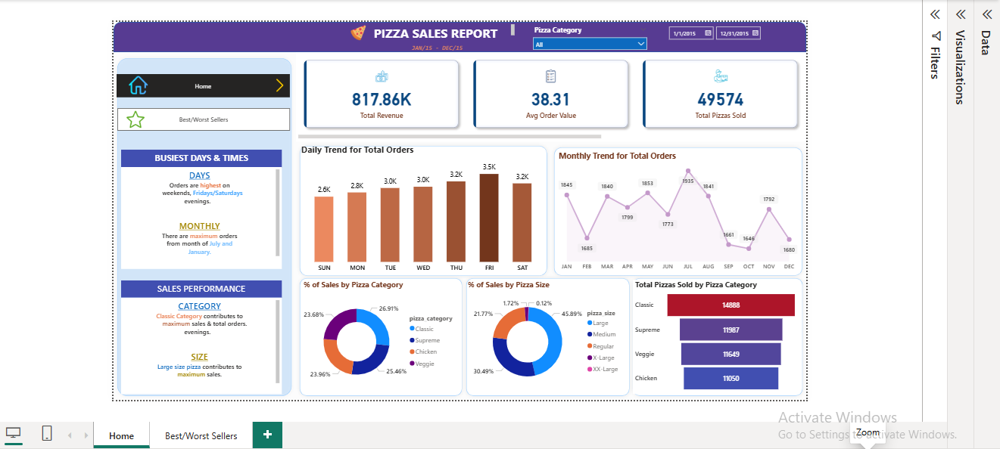
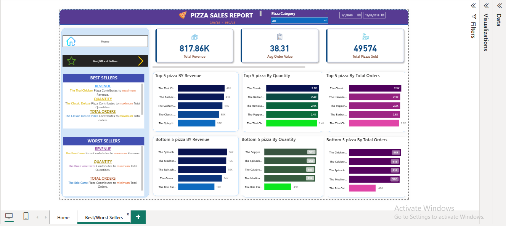

🍕 Power BI Pizza Sales Dashboard

This Power BI project visualizes a pizza sales dataset to extract valuable business insights. The dashboard includes key performance indicators (KPIs), trends, and comparative analysis to understand customer behavior and sales performance.

📌 Objective

To analyze pizza sales data and identify trends, top-performing products, and areas for improvement using interactive and insightful visualizations.

 📊 Dashboard Overview

### ✅ KPIs Displayed:
- **Total Revenue**: $817.86K  
- **Average Order Value**: $38.31  
- **Total Pizzas Sold**: 49,574  

### ✅ Charts Included:
1. **Daily Trend for Total Orders**  
   _Bar chart showing order volume by weekday to identify sales fluctuations._

2. **Monthly Trend for Total Orders**  
   _Line chart showing monthly sales trends across the year._

3. **% of Sales by Pizza Category**  
   _Pie chart showing distribution by categories (Classic, Veggie, etc)._

4. **% of Sales by Pizza Size**  
   _Pie chart showing customer preferences by pizza size._

5. **Total Pizzas Sold by Category**  
   _Funnel chart comparing total quantity sold per category._

6. **Top 5 Best Sellers by Revenue, Quantity & Orders**  
   _Bar charts showing best-performing pizzas across multiple metrics._

7. **Bottom 5 Sellers by Revenue, Quantity & Orders**  
   _Bar charts for least popular/performing pizza types.

## 📸 Screenshots

### 🔹 Home Page – KPIs and Trends

### 🔹 Best/Worst Sellers Page

## 🛠️ Tools Used

1. Power BI Desktop
2. Data Modeling (DAX)
3. Data Cleaning (Power Query)
4. SQL (for data extraction & prep)

 📂 How to View the Dashboard

1. Download the `.pbix` file (if uploaded).
2. Open using [Power BI Desktop](https://powerbi.microsoft.com/en-us/desktop/).
3. Navigate through tabs: `Home`, `Best/Worst Sellers`, and more.

📬 Contact

Feel free to connect for feedback or collaboration!

> Created by Bhavish Singh 
> 📧 Email: singhbhavish7011@gmail.com

⭐ If you like this project, consider giving it a star!
